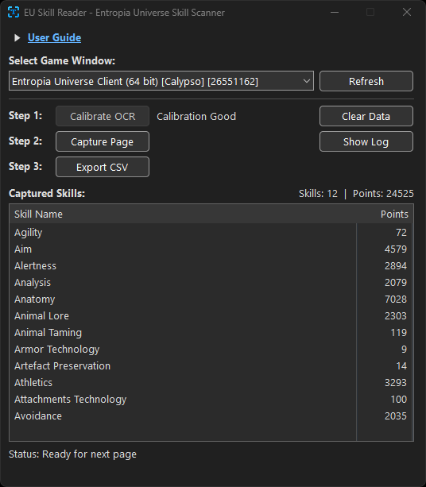

# EU Skill Reader

Reads skill names and point values from the Entropia Universe skill window via screen capture and exports them to CSV. Portable Windows-x86_64 executable. No external dependencies.

**[Download latest release](https://github.com/entropiadata/eu_skill_reader/releases/latest)**



## How It Works

The app captures a screenshot of the game window, locates the skill panel, and reads each row using template-based digit recognition tuned to the game's Scaleform-rendered text. Skill names are matched against a known ordered list (the game always displays skills in the same order), so even partially occluded names resolve correctly.

The full skill list (174 skills with hidden/visible flags) is embedded in the binary. To override it, place an `eu_skill_list.csv` file next to the executable.

## Building

Requires Visual Studio 2022 (MSVC) and CMake. No external libraries.

```
cmake -B build -G "Visual Studio 17 2022" -A x64
cmake --build build --config Release
```

Or use the task runner:

```
want build
```

Output: `build\Release\eu_skill_reader.exe`

## Usage

1. Run the game in windowed mode. Open the Skills window and drag it to the top-left corner of the game window.
2. Launch `eu_skill_reader.exe`. Select the correct game window from the dropdown.
3. In-game, select "ALL CATEGORIES" and sort by "SKILL NAME" so Agility is first. Navigate to page 1.
4. Click **Calibrate OCR** to ready the tool, attempt to capture and parse the first page.
5. If no errors, click to the next page in-game, then click **Capture Page**. Repeat for each page.
  * The scanner window will be forced on top of all other windows. It will not interrupt or break the scanning, so feel free to place it so clicking the buttons is a quick back and forth motion.  
6. Once all pages have been read, click **Export CSV** to save all captured skills. You can also select skills from the List view and copy them out at any time.

## Skill List

Skills are matched in display order rather than by raw OCR of the name column. This makes recognition fast and accurate even with anti-aliased or partially obscured text.

The embedded list covers all 174 skills as of 2025. If MindArk adds new skills, create `eu_skill_list.csv` next to the exe with the updated list:

```
Agility,false
Aim,false
Animal Taming,true
...
```

Format: `SkillName,hidden` — where `hidden=true` means the skill only appears once unlocked.

## CSV Output

```
Skill Name,Points
Agility,1234
Aim,5678
...
```

## Project Structure

```
src/
  main.cpp           Win32 UI (ListView, dark mode, CSV export)
  app.cpp/h          Calibration, page capture, duplicate detection
  capture.cpp/h      Window enumeration and GDI screen capture
  font_atlas.cpp/h   GDI font rendering for glyph templates
  text_reader.cpp/h  Digit recognition (binarize, segment, template match)
  skill_window.cpp/h Skill window layout and row parsing
  skill_data.cpp/h   Skill list (embedded + external CSV override)
  types.h            Shared types (Bitmap, Pixel, SkillEntry, etc.)
```

## Tests

```
cmake --build build --config Release
build\Release\test_numbers.exe                                              # 149 synthetic digit tests
build\Release\test_png_numbers.exe C:\path\to\eu_skill_reader               # 339 tests against real screenshots
```

## Requirements

- Windows 10/11
- Entropia Universe running in windowed or borderless windowed mode

## Special Thanks

- **[stb_image](https://github.com/nothings/stb)** and **[stb_image_write](https://github.com/nothings/stb)** by Sean Barrett -- public domain single-header image loading and writing libraries
- **[miniz](https://github.com/richgel999/miniz)** by Rich Geldreich -- public domain single-file ZIP/deflate compression library
- **[Microsoft Fluent UI System Icons](https://github.com/microsoft/fluentui-system-icons)** -- application icon
- **[Entropia Universe](https://www.entropiauniverse.com/)** by MindArk -- the game this tool was built for

## Copyright & License

Copyright © 2026 - The Entropia Data Project Contributors 

Released under the MIT License

